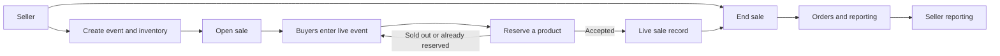
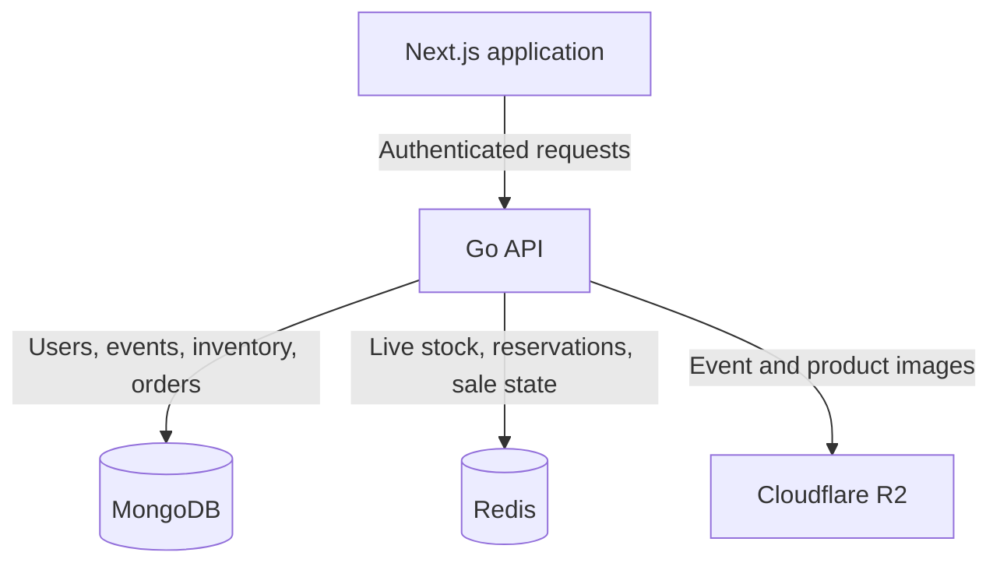
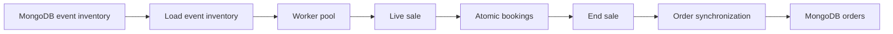
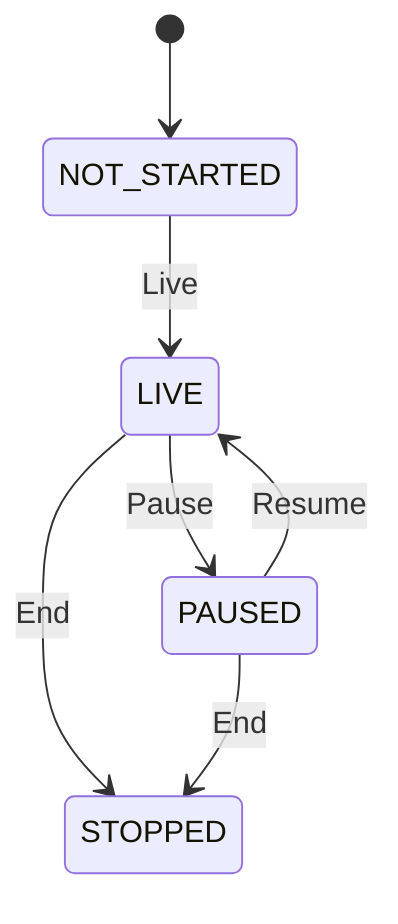
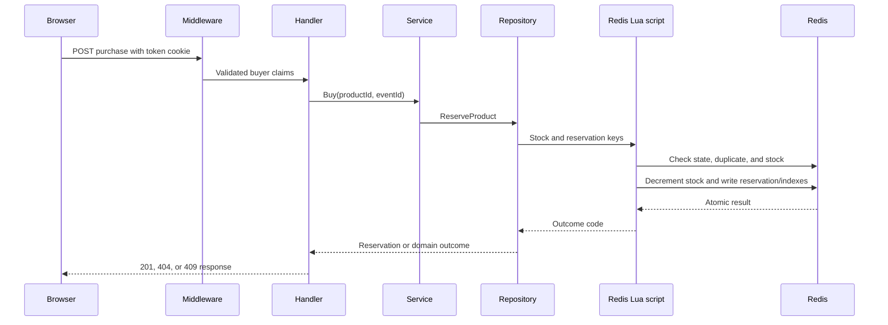
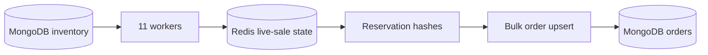
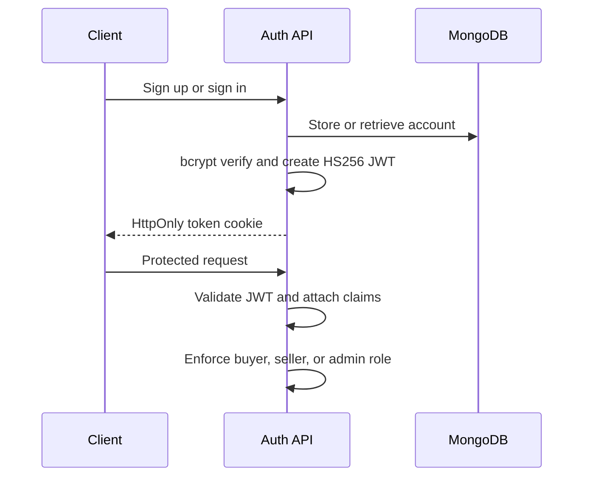

# Orbit

> Event-scoped flash sales with an atomic reservation path for limited inventory.

[](go.mod)
[](web/package.json)
[](LICENSE)

Orbit is a backend-first flash-sale system for products with limited inventory. It moves the contended purchase decision into an atomic reservation flow, while preserving catalogue and completed-order data as durable records.



## Contents

- [Problem and approach](#problem-and-approach)
- [Architecture](#architecture)
- [Sale lifecycle](#sale-lifecycle)
- [Booking engine](#booking-engine)
- [Data model and synchronization](#data-model-and-synchronization)
- [Design philosophy](#design-philosophy)
- [Architecture tradeoffs](#architecture-tradeoffs)
- [Failure handling](#failure-handling)
- [Authentication](#authentication-and-authorization)
- [Repository guide](#repository-guide)
- [Configuration and local setup](#configuration-and-local-setup)
- [Benchmark](#benchmark)
- [Known integration gaps](#known-integration-gaps)

---

## Problem and approach

In a limited release, many buyers can request the same unit at once. Reading stock in application code and decrementing it in a later call allows competing requests to observe the same availability.

Orbit separates the system into two phases:

1. **Catalogue phase:** events and inventory live in MongoDB.
2. **Live-sale phase:** inventory is projected into Redis, where one Lua script decides whether a reservation succeeds.
3. **Settlement phase:** accepted reservations are idempotently synchronized to MongoDB as orders when the sale ends.

This keeps the buyer path small and gives the system one explicit concurrency boundary.

---

## Architecture



### Data ownership by phase

| Phase | Primary store | What it owns |
| --- | --- | --- |
| Before a sale | MongoDB | Users, events, product definitions, scheduled inventory |
| During a sale | Redis | Stock, sale-time price, reservations, sale status, event indexes |
| After a sale | MongoDB | Idempotently persisted orders and analytics input |
| Media lifecycle | Cloudflare R2 | Event banners and product images |

The API is responsible for moving inventory into the live-sale model and synchronizing reservations back into durable orders. The web application provides the buyer-facing interface, session checks, and backend proxy routes.

---

## Sale lifecycle



### 1. Prepare and open

A seller creates an event and products. `POST /api/seller/events/:eventId/Live` transitions the event from `NOT_STARTED` to `LIVE`, streams its inventory from MongoDB, and sends product payloads to the worker pool. The pool writes live stock and metadata to Redis using pipelines. MongoDB is marked `isLive` only after the Redis load succeeds.

### 2. Accept reservations

Buyers can list live events, retrieve event products, and purchase a product. Purchases do not query MongoDB for availability; the booking engine uses the Redis live inventory.

### 3. Stop and settle

`POST /End` transitions the sale to `STOPPED`, reads event reservation hashes, bulk-upserts orders into MongoDB by `reservationId`, marks the event non-live, and removes transient Redis keys asynchronously.



The sale state machine is enforced by a separate Redis Lua compare-and-set script. Repeating `End` is supported: it reruns order synchronization rather than reopening the sale.

---

## Booking engine

The booking engine in [`internal/repositories/redis.go`](internal/repositories/redis.go) is the concurrency boundary for a purchase. It exists to make the stock decision once, atomically, under contention.

### Reservation invariants

- Only a `LIVE` sale accepts a reservation.
- A buyer can reserve a product once per event.
- Stock decrements only after all checks succeed.
- The reservation, product winner entry, and event booking entry are created together.
- The price returned to the buyer is the price stored in the live product hash.



The buyer handler applies a 500 ms request context. The Lua script returns distinct outcomes for sold out, duplicate booking, missing product, and inactive sale; the service maps them to domain errors and the handler maps those errors to HTTP responses.

Accepted reservations are not written to MongoDB in the buyer request. Their reservation key becomes the `reservationId` used by end-of-sale order upserts, which makes settlement safe to retry.

---

## Data model and synchronization



### Redis live-sale model

Redis owns the high-contention window. It is not a cache on the buyer path; it is the store used to decide availability during a live sale.

| Key pattern | Type | Purpose |
| --- | --- | --- |
| `product:{productId}:{eventId}` | Hash | Live `stock` and sale-time `price` |
| `productmeta:{productId}:{eventId}` | Hash | Product and seller metadata |
| `booking:{userId}:{productId}:{eventId}` | Hash | Reservation identity, status, price, and timestamp |
| `event:{eventId}:product:{productId}:winners` | Set | Buyers who reserved a product |
| `event:{eventId}:bookings` | Set | Reservation keys to settle when the sale ends |
| `event:{eventId}:productKeys` | Set | Product keys to remove after the event |
| `event:{eventId}:saleStatus` | String | `NOT_STARTED`, `LIVE`, `PAUSED`, or `STOPPED` |

The service also supports TTL-backed pending-payment reservations, though the currently wired buyer route creates confirmed reservations without a payment window.

### MongoDB durable model

| Collection | Purpose |
| --- | --- |
| `users` | Accounts, password hashes, roles, and buyer/seller profiles |
| `events` | Seller ownership, schedule, banner URL, and live flag |
| `inventories` | Product definitions, price, frequency, and image URL |
| `verification` | Seller verification requests and review state |
| `orders` | Settled reservations and analytics source data |

`BulkUpsertOrders` uses `reservationId` as the upsert filter. A failed or repeated end-of-sale synchronization can therefore retry without duplicating orders.

---

## Design philosophy

The repository follows a few narrow principles that keep the live-sale path understandable:

- **Keep the booking path short.** Authentication, one service call, and one atomic repository operation are on the purchase path. Image work, catalogue loading, analytics, and order persistence are not.
- **Put high-contention work where it belongs.** Redis owns live stock and reservations because these operations need low-latency atomic coordination.
- **Keep durable business data durable.** MongoDB owns accounts, catalogues, verification records, and settled orders.
- **Prefer idempotency before retries.** A reservation key is reused as an order identity so a retried settlement does not create another order.
- **Use explicit state transitions.** The sale lifecycle is a guarded state machine, not an unconstrained boolean flag.
- **Bound remote work.** Handlers and repositories use time-bounded contexts rather than allowing database and Redis calls to run indefinitely.
- **Scope inventory to an event.** Stock keys include both product and event IDs, isolating live inventory and cleanup to one sale.

---

## Engineering decisions

### Why Redis and Lua for booking?

Redis keeps the hot inventory state close to a single atomic operation. The Lua script removes the race between checking availability and decrementing stock, while also recording the reservation indexes needed for settlement. This avoids application-level locks and multi-round-trip stock decisions.

### Why a worker pool when a sale opens?

The event inventory may contain many products. Loading it into Redis is necessary before bookings begin, but serial writes would make sale activation unnecessarily slow. The pool uses 11 workers, a 200-item channel, batches of 100, Redis pipelines, and bounded retries to project inventory concurrently without putting that work on the buyer path.

### Why defer order persistence?

The buyer needs a fast, correct reservation decision. Persisting an order to MongoDB for every successful booking would add another remote dependency to the contended path. Orbit records the complete reservation in Redis and settles those records when the sale ends.

### Why explicit sale transitions?

Starting, pausing, resuming, and stopping a sale are concurrency-sensitive operations. A Lua transition accepts only declared source states, preventing concurrent control requests from silently overwriting each other.

---

## Architecture tradeoffs

The architecture intentionally concentrates some work at sale boundaries to keep the purchase path simple.

| Decision | Accepted tradeoff | Reason it fits this system |
| --- | --- | --- |
| Deferred order persistence | Orders are not durable until the sale is stopped and synchronized | The purchase decision remains a short Redis operation instead of a Redis-plus-MongoDB transaction |
| Redis live inventory | Active events consume Redis memory for hashes and index sets | Per-event keys allow low-latency atomic booking and targeted cleanup |
| Event-scoped projection | A sale must load inventory before becoming usable | The sale starts from a defined snapshot of product stock and price |
| Worker pool and pipelines | More coordination than a serial loader | Large event catalogues can be projected without making buyers wait for individual writes |
| End-of-sale synchronization | The stop operation performs data conversion and persistence work | The durable order ledger is created from the exact reservation records that won the live sale |

---

## Failure handling

The sale lifecycle contains explicit recovery behavior:

| Failure point | Implemented behavior |
| --- | --- |
| Inventory projection fails | Worker errors are returned; tracked event product keys are cleaned up |
| Event live-flag update fails after projection | The service attempts to transition `LIVE` back to `NOT_STARTED` |
| Redis worker flush fails | Each batch retries up to three times with incremental backoff; the first error is retained |
| Order synchronization is repeated | MongoDB bulk upserts by `reservationId`, making repeats idempotent |
| A reservation hash cannot be read or parsed at settlement | It is logged and skipped; remaining valid orders are still bulk-upserted |
| Transient cleanup fails | Cleanup errors are logged after settlement; the stopped status is retained with a 30-day expiry |

The implementation logs rollback and cleanup failures that may require manual inspection. It does not claim a distributed transaction between Redis and MongoDB.

---

## Authentication and authorization



- Passwords use bcrypt with cost 12.
- JWTs use HS256 and expire after two hours.
- JWT claims contain the account ID, email, role, email-verification state, active state, and approval state.
- `UserMiddleware` validates the `token` cookie and places claims in the Gin context; role middleware protects buyer, seller, and admin routes.

> Development behavior: sign-up currently creates active, email-verified, approved buyer and seller accounts. A production deployment needs real email verification, server-side authorization refresh, secure-cookie configuration, and an admin bootstrap path.

---

## API surface

| Module | Entry points |
| --- | --- |
| Authentication | `POST /api/auth/signup`, `POST /api/auth/signin`, `GET /api/auth/check` |
| Buyer | `GET /api/buyer/events`, `GET /api/buyer/event/:id`, `POST /api/buyer/event/:eventId/purchase/:productId` |
| Seller | Event and product CRUD under `/api/seller/events`; sale controls at `Live`, `Pause`, `Resume`, and `End` |
| Orders | Seller event orders and event analytics |
| Admin | Seller verification list, detail, approval, and rejection |

[`api/openapi.yaml`](api/openapi.yaml) is a reference contract. The Go route definitions are the current implementation; request and response details in the OpenAPI file have drifted and should be reconciled before treating it as authoritative.

---

## Repository guide

### Where to start

| If you want to understand | Start here | Why it exists |
| --- | --- | --- |
| Booking correctness | [`internal/repositories/redis.go`](internal/repositories/redis.go) | Atomic reservation Lua script and outcome mapping |
| Sale lifecycle | [`internal/repositories/salecontrol.go`](internal/repositories/salecontrol.go) | State transitions, settlement, cleanup, and idempotency |
| Inventory projection | [`internal/worker/worker.go`](internal/worker/worker.go) | Concurrent MongoDB-to-Redis loading |
| Buyer request path | [`internal/buyer`](internal/buyer) | Handler, service, and route composition for purchases |
| Authentication | [`internal/middleware/accountMiddleware.go`](internal/middleware/accountMiddleware.go) | Cookie JWT validation and role guards |
| Route composition | [`internal/routerGroup/router.go`](internal/routerGroup/router.go) | API module registration |
| Benchmark workload | [`cmd/tests`](cmd/tests) | Concurrent seller, buyer, and metric collection flow |

```text
cmd/
  server/                  API bootstrap and graceful shutdown
  tests/                   Integration flow and buyer benchmark
configs/                   Environment-backed configuration
internal/
  auth/                    Sign-up, sign-in, and session check
  admin/                   Seller verification review
  buyer/                   Live event catalogue and purchase service
  db/                      MongoDB, Redis, and R2 client initialization
  middleware/              JWT cookie and role guards
  models/                  MongoDB document models
  repositories/            Persistence, Lua scripts, and sale coordination
  seller/                  Verification, events, products, and sale controls
  worker/                  Concurrent inventory projection
  rediskeys/               Redis key builders
web/                        Next.js application and BFF routes
api/openapi.yaml           OpenAPI reference
```

---

## Configuration and local setup

### Prerequisites

- Go 1.26 or later
- Node.js 20 or later
- MongoDB
- Redis
- An S3-compatible Cloudflare R2 bucket

> The API initializes MongoDB, Redis, and R2 at startup. R2 credentials are required even when testing non-media routes.

Create a root `.env` file:

```dotenv
# Use 9132 to match the frontend and benchmark defaults.
PORT=9132
MONGODBURI=mongodb://localhost:27017
JWT_KEY=replace-with-a-long-random-secret

# Redis expects host:port, not a redis:// URI.
REDIS_URL=localhost:6379
REDIS_PASS=

R2_ACCESS_KEY_ID=
R2_SECRET_ACCESS_KEY=
R2_ENDPOINT=https://<account-id>.r2.cloudflarestorage.com
R2_BUCKET_NAME=orbit
R2_DOMAIN=https://<public-r2-domain>
```

`MONGODBURI`, `JWT_KEY`, `REDIS_URL`, `R2_ACCESS_KEY_ID`, `R2_SECRET_ACCESS_KEY`, `R2_ENDPOINT`, and `R2_BUCKET_NAME` are required by the server. `R2_DOMAIN` supplies the public URL prefix returned after upload.

The Go server defaults to port `8000`; the frontend and benchmark default to `9132`. Set `PORT=9132` when running the full local stack.

Start the API:

```bash
go run ./cmd/server
```

Start the web application in another terminal:

```bash
cd web
npm ci
BACKEND_API_URL=http://localhost:9132 npm run dev
```

---

## Benchmark

[`cmd/tests`](cmd/tests) is an integration executable, not a unit-test suite. Its configured scenario:

- registers and updates 100 single-unit products with five concurrent seller workers;
- creates 5,000 buyers through a 100-worker signup pool;
- signs each buyer in and sends one concurrently targeted product reservation;
- reports total requests, successes, sold-out results, duplicate bookings, errors, average latency, and throughput.

> Current limitation: the executable runs an admin verification flow before creating a pending verification request and does not bootstrap an authenticated admin client. It documents the intended end-to-end workload, but is not currently a one-command reproducible benchmark.

Run only against disposable infrastructure because the harness creates users, events, R2 objects, and orders:

```bash
go run ./cmd/tests
```

---

## Known integration gaps

The live-sale backend is implemented. The Next.js application remains partly a product prototype:

- Without `BACKEND_API_URL`, it serves the static demo catalogue in `web/lib/catalog.js`.
- With `BACKEND_API_URL`, event lookup passes a URL slug while the Go buyer API expects a MongoDB event ID.
- The frontend expects a richer event shape than the buyer API returns.
- The web order route provides `eventSlug` while its backend call expects `eventId`.

An event slug/read model, or routing the UI by object ID, is required to connect the demo interface to the live booking flow.

---

## Verification

The repository was checked with:

```bash
go test ./...
cd web && npm run lint
```

All Go packages compile. The web linter has no errors and reports two existing `@next/next/no-img-element` warnings in the marketing page.

---

## License

Orbit is licensed under the [Apache License 2.0](LICENSE).
